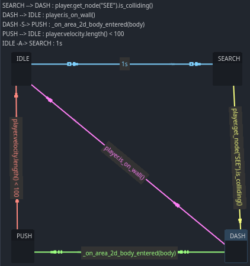

# Finite State Machine

Un Finite State Machine (FSM) basado en un AnimationPlayer modificado.

Al crear animaciones se generaran los estados (nodos hijos al FSM). Los estados poseen 4 funciones que se ejecutan según si esta el estado activado o se cambia de estado:

- Entrar: se ejecuta cuando entra el estado, al cambiar de estado

- Revisar: se ejecuta cuando el estado esta activo, antes del ejecutar, y se usa para revisar las condiciones que hacen el cambio de estado

- Ejecutar: ejecuta el _physics_process del player, contiene la lógica del estado

- Salir: se ejecuta cuando sale el estado, al cambiar de estado

Adicionalmente poseen la señal `cambiarEstado` que permite el cambio de estado. Por ejemplo, si estoy en el estado `RUN` y en revisar tengo `cambiarEstado.emit("IDLE")` ocurrirá lo siguiente:

    1- No se ejecutara el ejecutar del RUN
    2- Se ejecutara el salir del RUN
    3- Se ejecutara el entrar de IDLE
    4- Quedara activo el el estado IDLE

Los estados poseen la variable `player` en donde se encuentra el objete que debe controlar el FSM

Adicionalmente, se cuenta con un visor de diagrama de FSM, aparecerá abajo (al lado del editor de Shader) cuando se seleccione el nodo FSM, facilitando la comprensión del FSM

Arriba a la izquierda, aparecerá una lista con las conexiones con la forma:

    estado inicial --> estado final : condición de cambio

Las flechas representan:

    --> : cambio indicado en revisar del estado
    -A-> : cambio indicado en la animación
    -S-> : cambio indicado por señal

En la primer visualización los estados aparecerán desordenados, para las siguientes visualizaciones, los mismos aparecerán en la ultima posición que se hayan dejado